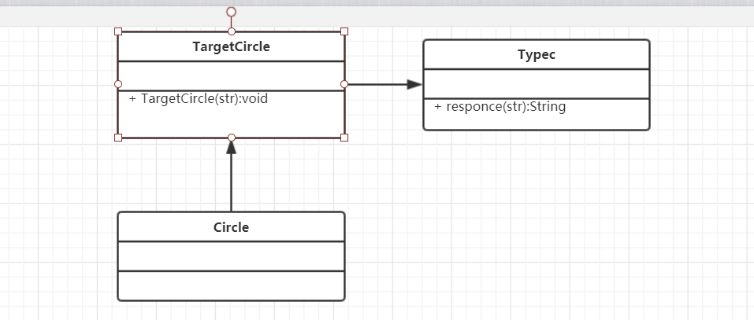
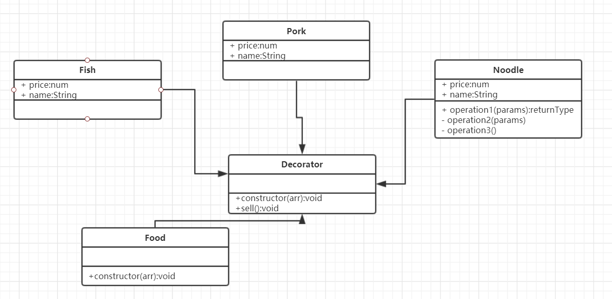
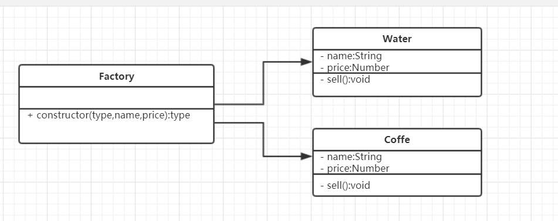
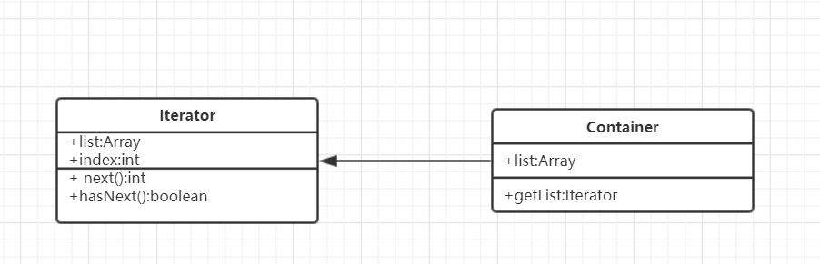
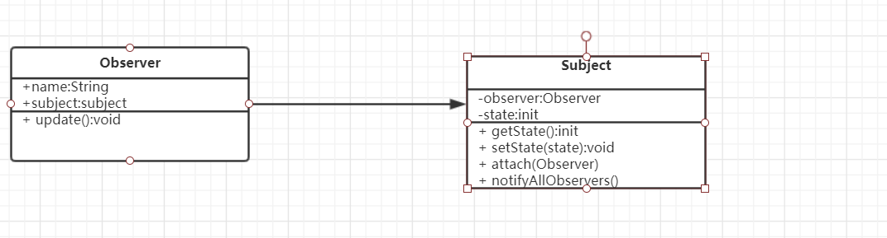
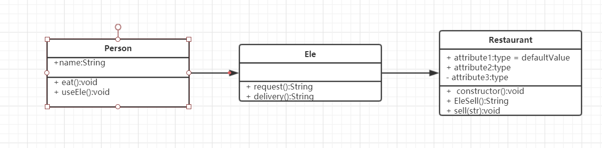
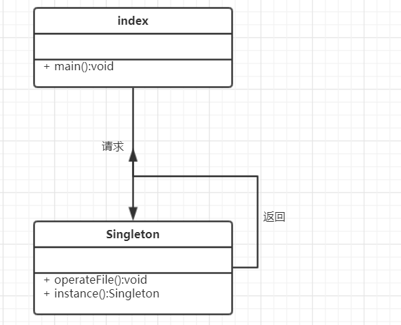

# jsDesignPattern
javascript设计模式

-  [适配器模式](#适配器模式)
-  [装饰器模式](#装饰器模式)
-  [简单工厂模式](#简单工厂模式)
-  [迭代器模式](#迭代器模式)
- [观察者模式](#观察者模式)
- [代理模式](#代理模式)
- [单例模式](#单例模式)
  
## 适配器模式
   - 适配器模式(Adapter Pattern)：将一个接口转换成客户希望的另一个接口，使接口不兼容的那些类可以一起工作，其别名为包装器(Wrapper)。适配器模式既可以作为类结构型模式，也可以作为对象结构型模式。比如圆口耳机转type-c 。

## 装饰器模式 
  - 装饰者模式（Decorator Pattern）：在不改变原类和继承情况下，动态添加功能到对象中，通过包装一个对象实现一个新的具有原对象相同接口的新对象。
  装饰者模式有以下特点：

    - 添加功能时不改变原对象结构。
    - 装饰对象和原对象提供的接口相同，方便按照源对象的接口来使用装饰对象。
    - 装饰对象中包含原对象的引用。即装饰对象是真正的原对象包装后的对象。

## 简单工厂模式 
  - 可重复执行，来创建相似对象。
  - 当编译时位置具体类型（类）时，为调用者提供一种创建对象的接口。

## 迭代器模式 
  - 迭代器模式(Iterator Pattern) 是提供一种方法，顺序访问一个聚合对象中每个元素，并且不暴露该对象内部。
  这种模式属于行为型模式，有以下几个特点：

    - 访问一个聚合对象的内容，而无需暴露它的内部表示。
    - 提供统一接口来遍历不同结构的数据集合。
    - 遍历的同事更改迭代器所在的集合结构可能会导致问题。

## 观察者模式
  - 观察者模式(Observer Patterns) 也称订阅/发布（subscriber/publisher）模式，这种模式下，一个对象订阅定一个对象的特定活动，并在状态改变后获得通知。这里的订阅者称为观察者，而被观察者称为发布者，当一个事件发生，发布者会发布通知所有订阅者，并常常以事件对象形式传递消息。 

## 代理模式
   - 代理模式(Proxy Pattern) 为其他对象提供一种代理，来控制这个对象的访问，代理是在客户端和真实对象之间的介质。

 ## 单例模式
    - 单体模式(Singleton Pattern)的思想在于保证一个特定类仅有一个实例，即不管使用这个类创建多少个新对象，都会得到与第一次创建的对象完全相同。通过Singleton调用获取对象，而不是new出来。
